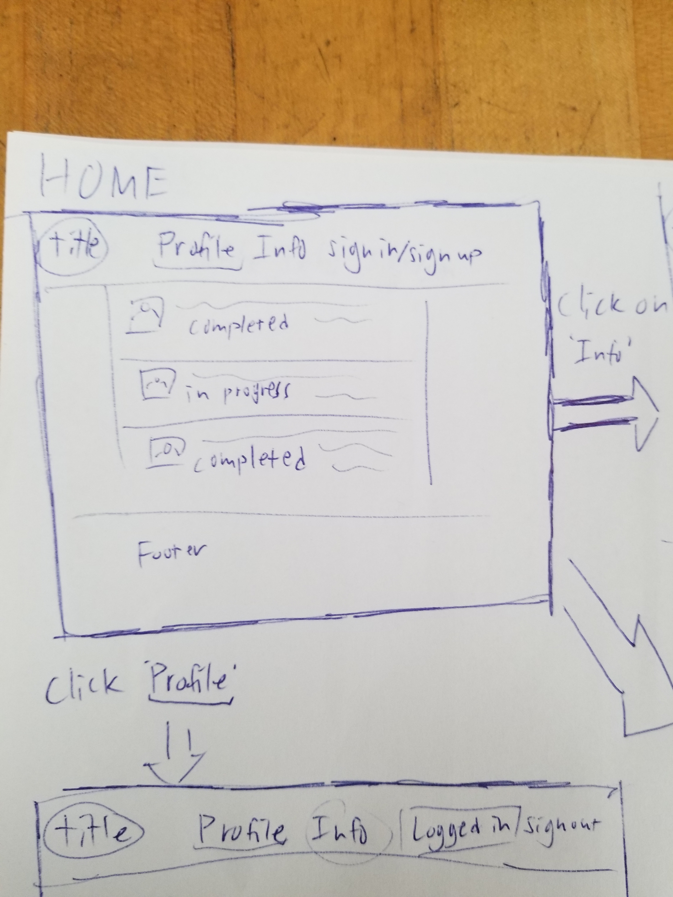
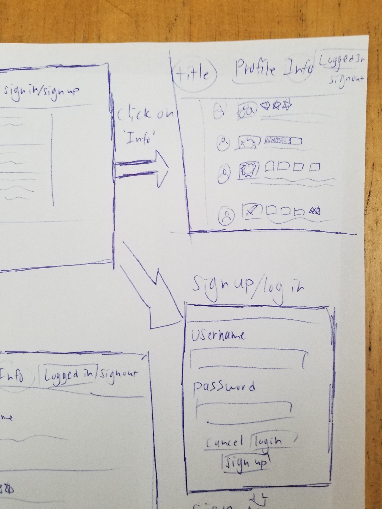
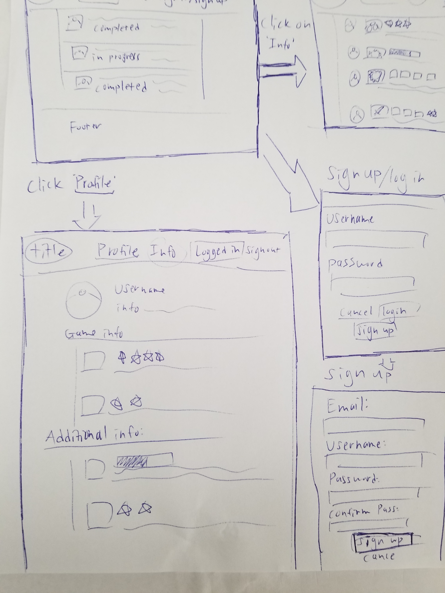

# Juniors Spring Intensive Deliverable Proposal

## TODO: copy this file, fill it out, and push it up to your project's repo.

Dates 3/16-3/25

**My Name:ß** 

Kento Murata

**Project Name:**

GameTrace

**Is your project New or Old?**

New Project

**Is your project Solo or Team?**

Solo Project

## Description

**Write a paragraph summary of the current status of your project, what you hope to achieve during the intensive, how and why.**

My current status on my project is needing proposal approval. I want to improve my Flask and database skills while creating this project. I feel like I was attempting to learn Django as another framework for BEW, but I need to improve my skills in Flask as well. Becoming familiar with multiple frameworks can open oppotunities for me to use the one that I am more comfortable with.

## Challenges I Anticipate

**List out the challenges you anticipate for completing this project.**

I anticipate that I may have trouble getting used to using flask after practicing Django for my previous projects. I want to review the concepts I learned to create a Flask app and create an app that could use databases to store a user's data (Achievements, friends, etc...) I may transform this into a bigger project, but I want to get used to Flask.

## Skateboard

**ONE SINGLE aspect of product. Consider: build backend for SPD 1.2 front end, CRUD one resource, use API or library, authentication etc.**

 I want to allow users to CRUD their "game data" into the website, and create a database that I could store the info.

**Start coding and finish “Skateboard” feature before beginning “Bike”.** 

## Bike
**ONE additional features that get you closer to your idealized product. Examples: CRUD 2nd resource, add comments, API use, authentication, library use.**

See how I can pull data from a database (pictures, text, etc...) and then I would have a way to grab outside data.

## Car
**ONE additional feature.**

User sign in/register for website

## Personal Achievement Goals:

**Each teammate must achieve 2 of 3 of their self-set personal achievement goals. If you're not on a team, delete the other teammate sections as needed.** 

1. I want to get better at my time-management for this project.
2. Solving the problems I face by finding solutions on the internet and friends.
3. Breaking my tasks into smaller parts so that I can manage my time.

## Wireframes

**Insert wireframe pictures here**

## Evaluation

**You must meet the following criteria in order to pass the intensive:**

- Students must get proposal approved before starting the project to pass
- SOLO 
    - must score an average above a 2.5 on the [rubric]
- TEAM 
    - Must score an average above 3 on the [rubric]
    - Each individual completes 2 of the 3 personal achievement goals from their proposal
- Pitch your product

[rubric]:https://docs.google.com/document/d/1IOQDmohLBEBT-hyr-2vgw1mbZUNsq3fHxVfH0oRmVt0/edit

## Approval Checklist
- [ ] If I have a team project, I wrote this proposal to represent my work and only my work
- [ ] I have completed all the necessary parts of this proposal
- [ ] I linked my proposal in the Spring Intensive Tracker

### Sign off

**Student Name:**                
> Name / Date
**Make School Advisor Name**
> TBD