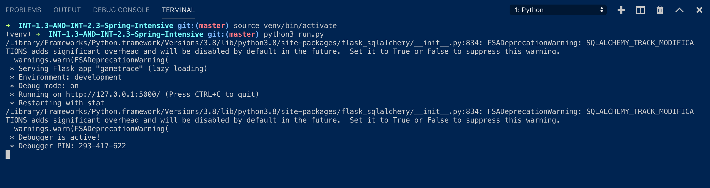

# GameTrace Website Link (Heroku app):  https://gametrace.herokuapp.com


## Need to make changes to database to postgre ==> heroku keeps reseting database

GameTrace gives users the ability to keep track of his/her in-game achievements, trophies, gameplay, etc when they are away from home base (their preferred gaming system). The current state of the project is an MVP, in which additional changes are being planned for implementation.

## Getting Started

These instructions will get you a copy of the project up and running on your local machine for development and testing purposes. See [Deployment](#deployment) for notes on how to deploy the project on a live system.

### Prerequisites

All dependencies are listed in the requirements.txt file in the repository.

### Installing

Clone this repository (Don't include the $. This symbol indicates that you need to write this command in the commandline in this repository):

```
$ git clone https://github.com/kmurata798/GameTrace.git
```

Traverse into the this repository:

```
$ cd /path/to/file/GameTrace
```



## Running the tests

Explain how to run the automated tests for this system

### Break down into end to end tests

Explain what these tests test and why

```
Give an example
```

### And coding style tests

Explain what these tests test and why

```
Give an example
```

## Deployment
Clone this repository and follow the instructions provided at this link [Heroku deployment](https://devcenter.heroku.com/articles/git)

## Built With

* [Dropwizard](http://www.dropwizard.io/1.0.2/docs/) - The web framework used
* [Maven](https://maven.apache.org/) - Dependency Management
* [ROME](https://rometools.github.io/rome/) - Used to generate RSS Feeds

## Contributing

Please read [CONTRIBUTING.md](https://gist.github.com/PurpleBooth/b24679402957c63ec426) for details on our code of conduct, and the process for submitting pull requests to us.

## Versioning

We use [SemVer](http://semver.org/) for versioning. For the versions available, see the [tags on this repository](https://github.com/your/project/tags). 

## Authors

* **Billie Thompson** - *Initial work* - [PurpleBooth](https://github.com/PurpleBooth)

See also the list of [contributors](https://github.com/your/project/contributors) who participated in this project.

## License

This project is licensed under the MIT License - see the [LICENSE.md](LICENSE.md) file for details

## Acknowledgments

* Hat tip to anyone whose code was used
* Inspiration
* etc
